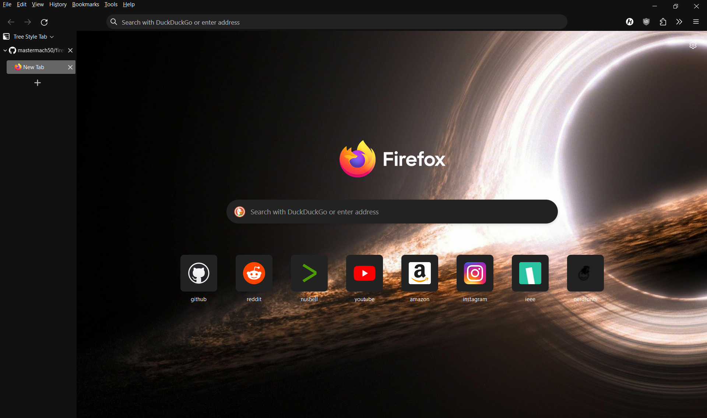

# Firefox Lumina
A userstylesheet dark theme for Firefox, designed for using with Tree Style Tabs.

> Wallpaper by [Glenn Carstens-Peters](https://unsplash.com/@glenncarstenspeters)


## Design Aspects
- The browser theme should not distract the user from the content of the page that they are viewing.
- The browser theme should mix elegantly with modern styles used by most sites.
- Vertical Tabs >>> Horizontal Tabs
- Rounded elements look better

## Installation
1. Clone the repo
```
git clone https://github.com/mastermach50/firefox-lumina.git --depth 1
```
2. Copy the `chrome` folder into your firefox user profile folder
> Remember to backup your current chrome folder if it exists

3. Go to `about:config` of firefox

4. Make sure that `toolkit.legacyUserProfileCustomizations.stylesheets` is enabled

5. Restart the browser

> Some parts of the browser are still not themed, like the settings page. These will be themed later on.
