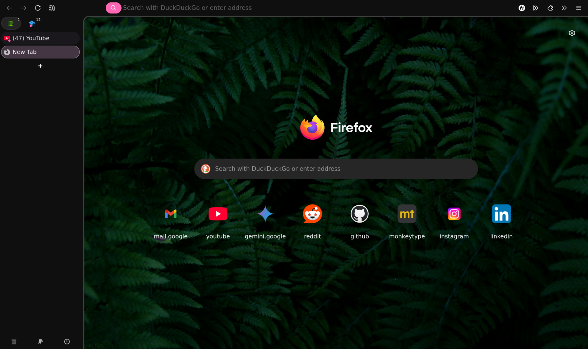

# Firefox Lumina
An unobtrusive, seamless Firefox theme.

## Installation
1. Download the files in this repo from [here](https://github.com/mastermach50/firefox-lumina/archive/refs/heads/main.zip)
   1. Unzip the files
2. Install and enable [Sidebery](https://addons.mozilla.org/en-US/firefox/addon/sidebery/)
   1.  Import the `sidebery-config.json` file into sidebery ( here: `moz-extension://e8aa9db0-845f-4685-b1cf-f89266810cc4/page.setup/setup.html#settings_help` )
3. Copy `chrome` and `user.js` into your Firefox profile folder ([Article: How to find your Firefox profile folder](https://www.howtogeek.com/255587/how-to-find-your-firefox-profile-folder-on-windows-mac-and-linux/)).
4. Restart Firefox

> If any part of Firefox seems unthemed please make an issue
